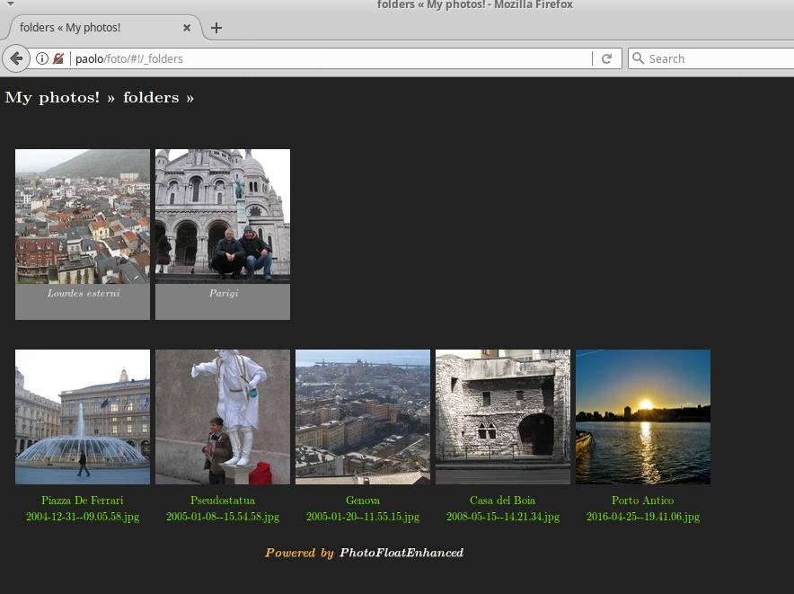
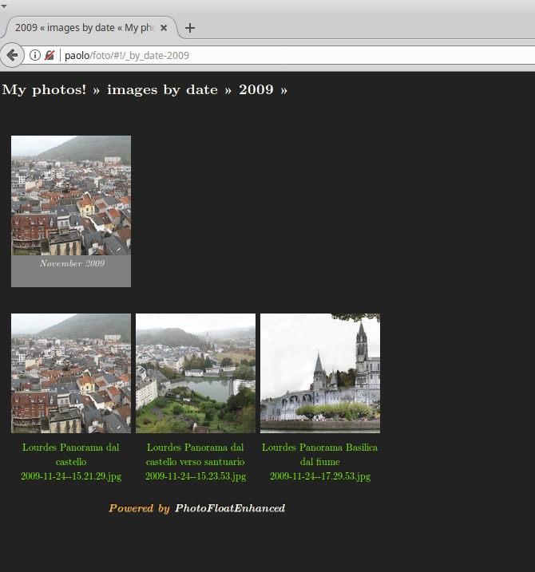

# photofloat
### A Web 2.0 Photo Gallery Done Right via Static JSON & Dynamic Javascript
#### by Jason A. Donenfeld (<Jason@zx2c4.com>), Joachim Tingvold (joachim@tingvold.com), Paolo Benvenuto (<paolobenve@gmail.com>)

It's an open source web photo gallery aimed at sleekness and speed. It keeps with an old hat mentality, preferring to work over directory structures rather than esoteric photo database management software. Everything it generates is static, which means it's extremely fast.

This is a Jason A. Donenfeld's Photofloat fork. It also received and merged Joachim Tingvold's patches about showing videos.

[Check out a demo!](http://palmaro.qumran2.net/#!/_folders-giovani-biscotti_natale_2016/giovani_preparazione_biscotti_2016-12-16-17.17.27.jpg)

## How It Works

photofloat consists of two segments – a Python script and a JavaScript application.

The Python script scans a directory tree of images, whereby each directory constitutes an album. It then populates a second folder, known as the cache folder with statically generated JSON files and thumbnails. The scanner extracts metadata from EXIF tags in JPEG photos. photofloat is smart about file and directory modification time, so you are free to run the scanner script as many times as you want, and it will be very fast if there are few or zero changes since the last time you ran it.

The JavaScript application consists of a single `index.html` file with a single `scripts.min.js` and a single `styles.min.css`. It fetches the statically generated JSON files and thumbnails on the fly from the `cache` folder to create a speedy interface. Features include:

* Animations to make the interface feel nice
* Separate album view and photo view
* Album metadata pre-fetching
* Photo pre-loading
* Recursive async randomized tree walking album thumbnail algorithm
* Smooth up and down scaling
* Mouse-wheel support
* Metadata display
* Consistant hash url format
* Linkable states via ajax urls
* Static rendering for googlebot conforming to the AJAX crawling spec.
* Facebook meta tags for thumbnail and post type
* Link to original images (can be turned off)
* Optional Google Analytics integration
* Optional server-side authentication support
* A thousand other tweaks here and there...

Features added by Paolo:

* A date tree is builded, permitting photo to be seen by year, month, date
* Root view makes the user choose between folders view and "by date" view
* When a photo is viewed, the user can switch between the folder the photo belongs and the year/month/date the photo was taken
* Thumbnails generation is faster then before
* Added customizable translations in index.html: feel free to customize your language

Features added by Joachim:

* manage videos
* generate minified css and js through external api

It is, essentially, the slickest and fastest, most minimal but still well-featured photo gallery app on the net.

## Installation

#### Download the source code from the git repository:

    $ git clone https://github.com/paolobenve/photofloat.git
    $ cd photofloat

#### Tweak the index.html page to have a custom title or copyright notice.

    $ vim web/index.html

#### Build the web page.

This simply runs all the javascript through Google Closure Compiler and all the CSS through YUI Compressor to minify and concatenate everything. Be sure you have java installed.

    $ cd web/js
    $ ./js-minify.sh
    $ cd ../css
    $ ./css-minify.sh 

#### Generate the albums:

Go back to web directory:

    $ cd ..

Make a folder for the pictures:

    $ mkdir albums

Alternatively, you can use an existing photo dir:

    $ ln -s /my/photo/folder albums

Samelessly, make a folder for cache:

    $ mkdir cache

You can create a symlink to an existing folder, too.

When you're done, fill albums folder with photos and directories of photos. You can also use symlinks. Run the static generator (you need Python≥2.6 and the Python Imaging Library):

    $ cd ../scanner
    $ ./main.py ../web/albums ../web/cache

After it finishes, you will be all set. Simply have your web server serve pages out of your web directory. You may want to do the scanning step in a cronjob, if you don't use the deployment makefiles mentioned below.

Note: The albums web folder could be anywhere in the file system.

cron file example with albums and cache in /var/www:

    # update photofloat cache
    
    58 1  * * *<--->root<-->cd /folder/where/you/have/photofloat  && ./scanner/main.py /var/www/html/foto/albums /var/www/html/foto/cache

## Optional: Server-side Authentication

The JavaScript application uses a very simple API to determine if a photo can be viewed or not. If a JSON file returns error `403`, the album is hidden from view. To authenticate, `POST` a username and a password to `/auth`. If unsuccessful, `403` is returned. If successful, `200` is returned, and the previously denied json files may now be requested. If an unauthorized album is directly requested in a URL when the page loads, an authentication box is shown.

photofloat ships with an optional server side component called FloatApp to faciliate this, which lives in `scanner/floatapp`. It is a simple Flask-based Python web application.

#### Edit the app.cfg configuration file:

    $ cd scanner/floatapp
    $ vim app.cfg

Give this file a correct username and password, for both an admin user and a photo user, as well as a secret token. The admin user is allowed to call `/scan`, which automatically runs the scanner script mentioned in the previous section.

#### Decide which albums or photos are protected:

    $ vim auth.txt

This file takes one path per line. It restricts access to all photos in this path. If the path is a single photo, then that single photo is restricted.

#### Configure nginx:

FloatApp makes use of `X-Accel-Buffering` and `X-Accel-Redirect` to force the server-side component to have minimal overhead. Here is an example nginx configuration that can be tweaked:

    server {                                                                                                               
            listen 80;                                                                                                     
            server_name photos.jasondonenfeld.com;                                                                         
            location / {
                    index index.html;
                    root /var/www/htdocs/photos.jasondonenfeld.com;
            }
    
            include uwsgi_params;
            location /albums/ {
                    uwsgi_pass unix:/var/run/uwsgi-apps/photofloat.socket;
            }
            location /cache/ {
                    uwsgi_pass unix:/var/run/uwsgi-apps/photofloat.socket;
            }
            location /scan {
                    uwsgi_pass unix:/var/run/uwsgi-apps/photofloat.socket;
            }
            location /auth {
                    uwsgi_pass unix:/var/run/uwsgi-apps/photofloat.socket;
            }
            location /photos {
                    uwsgi_pass unix:/var/run/uwsgi-apps/photofloat.socket;
            }
    
            location /internal-cache/ {
                    internal;
                    alias /var/www/uwsgi/photofloat/cache/;
            }
            location /internal-albums/ {
                    internal;
                    alias /var/www/uwsgi/photofloat/albums/;
            }
    }

Note that the `internal-*` paths must match that of `app.cfg`. This makes use of uwsgi for execution:

    metheny ~ # cat /etc/uwsgi.d/photofloat.ini 
    [uwsgi]
    chdir = /var/www/uwsgi/%n
    master = true
    uid = %n
    gid = %n
    chmod-socket = 660
    chown-socket = %n:nginx
    socket = /var/run/uwsgi-apps/%n.socket
    logto = /var/log/uwsgi/%n.log
    processes = 4
    idle = 1800
    die-on-idle = true
    plugins = python27
    module = floatapp:app

## Optional: Deployment Makefiles

Both the scanner and the webpage have a `make deploy` target, and the scanner has a `make scan` target, to automatically deploy assets to a remote server and run the scanner. For use, customize `deployment-config.mk` in the root of the project, and carefully read the `Makefile`s to learn what's happening.

## License

Copyright (C):
* 2010 - 2014 Jason A. Donenfeld
* 2016 Joachim Tingvold
* 2017 Paolo Benvenuto

All Rights Reserved.

This program is free software; you can redistribute it and/or
modify it under the terms of the GNU General Public License
as published by the Free Software Foundation; either version 2
of the License, or (at your option) any later version.

This program is distributed in the hope that it will be useful,
but WITHOUT ANY WARRANTY; without even the implied warranty of
MERCHANTABILITY or FITNESS FOR A PARTICULAR PURPOSE.  See the
GNU General Public License for more details.

You should have received a copy of the GNU General Public License
along with this program; if not, write to the Free Software
Foundation, Inc., 51 Franklin Street, Fifth Floor, Boston, MA  02110-1301, USA.
