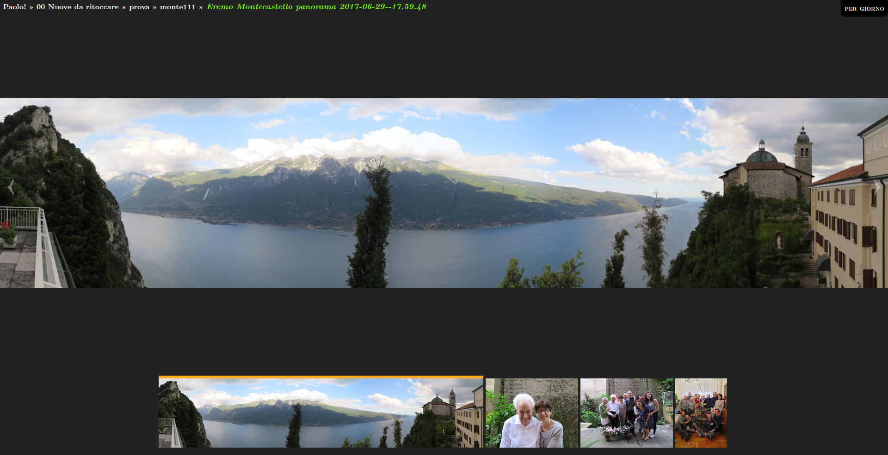

# MyPhotoShare v. 3.3
### A Web Photo Gallery Done Right via Static JSON & Dynamic Javascript
#### by Jason A. Donenfeld (<Jason@zx2c4.com>), Jerome Charaoui (jerome@riseup.net)  Joachim Tingvold (joachim@tingvold.com), Paolo Benvenuto (<paolobenve@gmail.com>), Pierre Métras (<p.metras@videotron.ca>)

## Description

**MyPhotoShare** is an open source web photo gallery aimed at sleekness and speed. It works over directory structures rather than esoteric photo database management software. Everything it generates is static, which means it's extremely fast.

It permits browsing the media by folder, date and geotags.

Content (albums and media files) can be shared over some popular social plaforms.

**MyPhotoShare** is a Jason A. Donenfeld's *photofloat* fork, enriched by Jerome Charaoui's patches permitting showing videos, Paolo Benvenuto's and Pierre Métras's following development.

[Check out a demo!](http://palmaro.qumran2.net/)

## Read more

* [Install and update procedure](doc/Install.md)
* [Gallery of MyPhotoShare screenshots](doc/Gallery.md)
* [Geotagging](doc/GPS.md)
* [Tweaking metadata with `album.ini`](doc/Metadata.md)
* [Make some albums private](doc/Authentication.md)
* [Versions changelog](doc/Changelog.md)
* [Known issues](doc/Issues.md)
* [License](doc/License.md)

## Features

### Gallery

- [x] Manages images and videos, and permits sharing them (single image or album).
- [x] Media can be browsed by folder, by date or by geolocation. Switching among album, date and place views.
- [x] Media and folders can be sorted ascending/descending by date or by name.
- [x] Thumbnails can be square (cropped, with optional face detection by [OpenCV](https://opencv.org/)) or full-content.

### For Photographers

- [x] Photos with GPS data can be browsed by country/region-state/place; names are retrieves in choosen language from geonames.org web service.
- [x] Fullscreen mode.
- [x] EXIF, IPTC and XMP Metadata display.
- [x] Link to original media.
- [x] Link for direct download.

### Mobile Friendly

- [x] Swipe gestures for mobile.
- [x] Sharp images and thumbnails on mobile.
- [x] Smooth media scaling.
- [x] Consistent hash URL format.

### Great User Experience

- [x] Keyboard navigation: arrows, pageup/down, `[esc]`, `[f]` (fullscreen), `[m]` (metadata).
- [x] Mouse-wheel support.
- [x] Animations to make the interface feel nice.
- [x] Separate album view and photo view.
- [x] Media animation when passing to next/previous media.
- [x] Available in English, Italian, Spanish, French. User interface translated via separate translation file. Add your language!

### Social

- [x] Share buttons for `facebook`, `whatsapp` (mobile only), `twitter`, `google+`, `email`; on `facebook`, `whatsapp` and `google+`: a preview of the image/album is shared.

### Performance

- [x] Album metadata pre-fetching.
- [x] Photo pre-loading.
- [x] Scanner uses recursive async randomized tree walking album thumbnail algorithm.
- [x] HTML5 with minified CSS and JavaScript files for minimal load time.

### And More...

- [x] Analytics with optional Google Analytics and Piwik integration.
- [x] Optional server-side authentication support.
- [x] Many customizations available through config file.
- [x] Cache folder can be managed with subdirs: useful for large repositories.
- [x] Source albums server folders can be anywhere on the server.
- [x] Folders (or trees) are not scanned if a marker in put inside them.
- [x] Scanner verbosity levels can be set in the configuration file.
- [x] Developer friendly with debug mode for using unminimized css's and js's.
- [x] Photos metadata can be overloaded by user defined values in special file `album.ini`.

## Community

Report bugs through [GitHub Issues](https://github.com/paolobenve/MyPhotoShare/issues).

You can fork MyPhotoShare and submit pull requests, too! We're open to adding more features!

If you have any questions, feel free to contact the MyPhotoShare community via our [mailing list/discussion group](https://groups.google.com/forum/#!forum/myphotoshareapp).

## How It Works

MyPhotoShare consists of two segments – a Python script and a JavaScript application.

The Python script scans a directory tree of images, whereby each directory constitutes an album. It then populates a second folder, known as the cache folder with statically generated JSON files and thumbnails. It writes an `options.json` file too in html root folder, putting inside it all the options from default config file or user config file. The scanner extracts metadata from EXIF tags in JPEG photos and other data from videos or `album.ini` user defined file in albums. MyPhotoShare is smart about file and directory modification time, so you are free to run the scanner script as many times as you want, and it will be quite fast if there are few or zero changes since the last time you ran it.

The JavaScript application consists of a single `index.php` file with a single `scripts.min.js` and a single `styles.min.css`. It fetches the `options.json` file and the statically generated JSON files and thumbnails on the fly from the `cache` folder to create a speedy interface.

MyPhotoShare features share buttons, and PHP permits to pass the shared image/video/album to social media:
- inserts link tag in `<head>...</head>` in order to let social media see the shared content;
- applies basic options to home page;
- insert proper parameters for analytics tracking.

It is, essentially, a slick and fast, minimal but still well-featured photo gallery app on the net, suitable for sharing your media with your friends.

### Performance of scanner

As a term of comparizon, on my medium-sized pc, with the images on a NFS mounted NAS partition:

* scanning for the first time a 124 photos directory for a total size of 295 MB takes about 100 seconds (about 1 sec/media, 1 media/sec).
* re-scan of "all OK" tree with 36000 media files for a total size of 87 GB takes about 14 minutes (about 20 ms/media, 50 media/sec).
