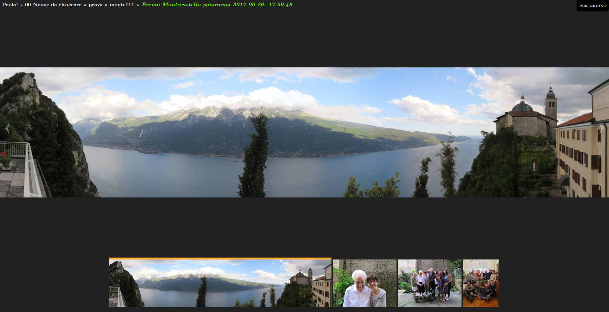
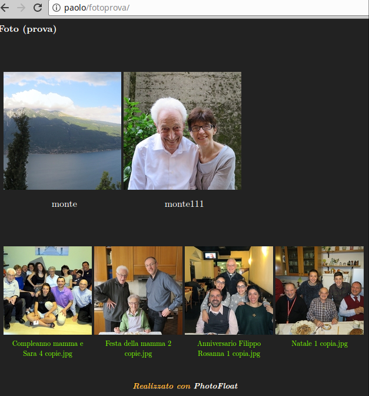
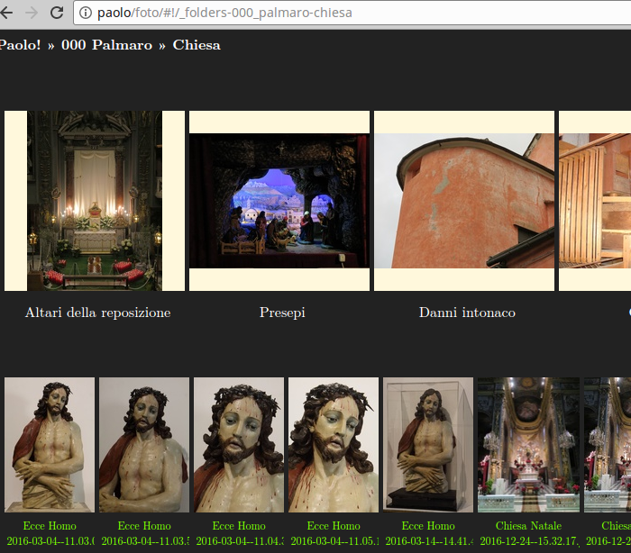
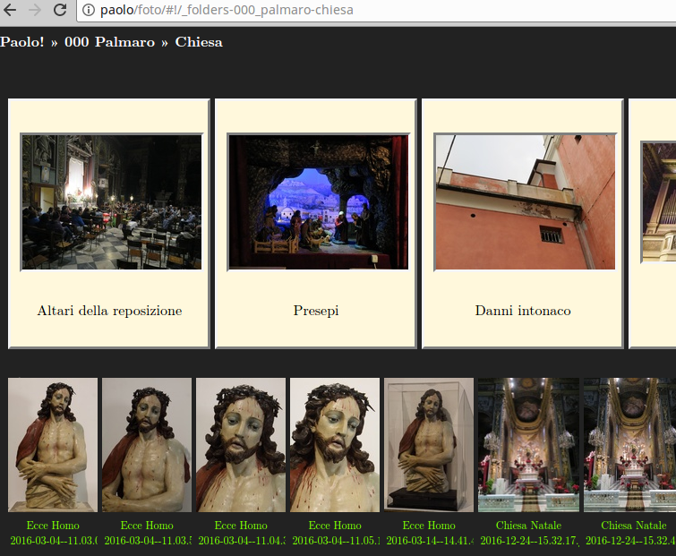

# myphotoshare v. 2.5
### A Web Photo Gallery Done Right via Static JSON & Dynamic Javascript
#### by Jason A. Donenfeld (<Jason@zx2c4.com>), Jerome Charaoui (jerome@riseup.net)  Joachim Tingvold (joachim@tingvold.com), Paolo Benvenuto (<paolobenve@gmail.com>)

## Description

`myphotoshare` is an open source web photo gallery aimed at sleekness and speed. It works over directory structures rather than esoteric photo database management software. Everything it generates is static, which means it's extremely fast.

Content (albums, media files) can be shared over some popular social plaforms.

`myphotoshare` is a Jason A. Donenfeld's `photofloat` fork, enriched by Jerome Charaoui's patches permitting showing videos, and Paolo Benvenuto's following development.

[Check out a demo!](http://palmaro.qumran2.net/)

## Features

* Fullscreen mode
* Metadata display
* Link to original images
* Manages images and videos
* Animations to make the interface feel nice
* Separate album view and photo view
* Album metadata pre-fetching
* Photo pre-loading
* Recursive async randomized tree walking album thumbnail algorithm
* Smooth media scaling
* Consistent hash url format
* Optional Google Analytics and Piwik integration
* Optional server-side authentication support
* Media can be browsed by folder or by date
* Many customization through config file
* Cache folder can be managed with subdirs (useful for large repositories)
* Albums and cache server folders can be anywhere on the server
* Images and folders can be sorted ascending/descending (via a cookie)
* Thumbnails can be square (cropped) or full-content
* Single `index.php` file: `php` applies basic option to home page (crawlers and social media do not execute javascript)
* Media animation when passing to next/previous image
* Folders (or trees) are not scanned if a marker in put inside them
* Verbosity levels in scanner

Usability:

* Swipe gestures for mobile
* Keyboard navigation: arrows, pageup/down, esc, f (fullscreen), m (metadata)
* Mouse-wheel support
* Share buttons for `facebook`, `whatsapp` (mobile only), `twitter`, `google+`, `email`; on `facebook`, `whatsapp` and `google+`: a preview of the image/album is shared
* User interface translated via separate translation file

## Community

Github platform permits you to report bugs.

You can fork `myphotoshare` and submit pull requests, too! We're open to adding more features!

If you have any question, feel free to contact the `myphotoshare` community via our [mailing list/discussion group](https://groups.google.com/forum/#!forum/myphotoshareapp).

## Screenshots

## How It Works

``myphotoshare`` consists of two segments – a Python script and a JavaScript application.

The Python script scans a directory tree of images, whereby each directory constitutes an album. It then populates a second folder, known as the cache folder with statically generated JSON files and thumbnails. It writes an `options.json` file too in html root folder, putting inside it all the options from default config file or user config file. The scanner extracts metadata from EXIF tags in JPEG photos and other data from videos. Photofloat is smart about file and directory modification time, so you are free to run the scanner script as many times as you want, and it will be quite fast if there are few or zero changes since the last time you ran it.

The JavaScript application consists of a single `index.php` file with a single `scripts.min.js` and a single `styles.min.css`. It fetches the `options.json` file and the statically generated JSON files and thumbnails on the fly from the `cache` folder to create a speedy interface.

Photofloat features share buttons, and `php` permits to pass the shared image/video/album to social media.

It is, essentially, a slick and fast, minimal but still well-featured photo gallery app on the net, suitable for sharing your media with your friends.

## Installation

### Dependencies

Photofloat needs:

* `python` 2.7
* `avconv` / `ffmpeg` in order to be able to manage videos.
* a working web server (e.g. `apache`, `nginx`, etc.) with `php` module installed
* `php5-gd` in order to create albums share images
* `curl`, used by minify script

#### Why `php`? Isn't it enough with javascript?

`php` is *needed* for sharing, because social media do not execute any javascript when they receive an *URI*. Without `php`, sharing any sit page is perfectly equivalent to sharing the simple index.html: no information of the particular page you want to share is retained.

`php` does the job you need for sharing: based on the page hash, it sets the proper html page title and the proper tag in `<head></head>` which permits the social media to get the info you want it to get and show a preview of the media/album you are sharing.

### Download the source code from the git repository:

    $ git clone https://github.com/paolobenve/myphotoshare.git
    $ cd myphotoshare

### Copy and tweak the configuration file

    $ sudo mkdir /etc/myphotoshare
    $ sudo cp myphotoshare.conf.defaults /etc/myphotoshare/myproject.conf
    $ sudo vim /etc/myphotoshare/myproject.conf

In your config file (myproject.conf, name can be whatever you want) you must set the proper folders for albums (your photo, they won't be modified) and cache (all the stuff `myphotoshare` requieres in order to work)

### Build the web page.

This simply minifies and concatenate everything of js and css.

    $ ./js-css-minify.sh

### Config your web server

Be sure you have a web server installed (`apache2`, `nginx`, ...), with `php` and `php5-gd` modules installed and set.

Be sure you installed `avconv` / `ffmpeg`.

The simplest way to configure the web server is:

* set `web` subdir as the root of your site
* `ln -s /absolute/path/to/your/albums/root albums`
* `mkdir cache` and give it proper permissions: `cache` must be writable by the scanner

However, "debian's way" could be better:

* clone `myphotoshare` repository in `/usr/share`, so that you end with a `/usr/share/myphotoshare` directory
* copy `myphotoshare.conf.defaults` to `/etc/myphotoshare` and properly config it
* in your web site root, put links to `myphotoshare` web folder files and directories: `css`, `favicon.ico`, `fonts`, `img`, `index.php`, `js`
* make sure the scanner has write access to your web site root

### (When `myphotoshare` code is updated) Update your `myphotoshare` installation

Go to the folder you cloned the repository in and execute:

    $ git pull https://github.com/paolobenve/myphotoshare.git
    $ ./js-css-minify.sh

Obviously the scanner should be launched too.

### Generate the albums:

When you're done run the static generator (you need Python≥2.6 and the Python Imaging Library; for video something like libav-conv is requiered too):

    $ /your/myphotoshare/installation/dir/scanner/main.py /etc/myphotoshare/myproject.conf

After it finishes, you will be all set. Simply have your web server serve pages out of your web directory. You may want to do the scanning step in a cronjob, if you don't use the deployment makefiles mentioned below.

Note: The albums web folder and the cache one could be anywhere in the file system or in web, the only requierement is that the web server has access to them.

#### `cron` file example:

You can automate the updating process, so that you don't need to worry of running the scanner, simply do whatever you want on your albums tree, and `myphotoshare` will be updated every night:

    # update myphotoshare cache
    58 1  * * * root    /your/myphotoshare/installation/dir/scanner/main.py /etc/myphotoshare/myproject.conf > /var/log/my-myphotoshare-project.log

Instead or running `myphotoshare` as root, you can use whatever user that have access to the directories you set up in your config file

## Optional: Server-side Authentication

The JavaScript application uses a very simple API to determine if a photo can be viewed or not. If a JSON file returns error `403`, the album is hidden from view. To authenticate, `POST` a username and a password to `/auth`. If unsuccessful, `403` is returned. If successful, `200` is returned, and the previously denied json files may now be requested. If an unauthorized album is directly requested in a URL when the page loads, an authentication box is shown.

`myphotoshare` ships with an optional server side component called FloatApp to faciliate this, which lives in `scanner/floatapp`. It is a simple Flask-based Python web application.

#### Edit the app.cfg configuration file:

    $ cd scanner/floatapp
    $ vim app.cfg

Give this file a correct username and password, for both an admin user and a photo user, as well as a secret token. The admin user is allowed to call `/scan`, which automatically runs the scanner script mentioned in the previous section.

#### Decide which albums or photos are protected:

    $ vim auth.txt

This file takes one path per line. It restricts access to all photos in this path. If the path is a single photo, then that single photo is restricted.

#### Configure nginx:

FloatApp makes use of `X-Accel-Buffering` and `X-Accel-Redirect` to force the server-side component to have minimal overhead. Here is an example nginx configuration that can be tweaked:

    server {                                                                                                               
            listen 80;                                                                                                     
            server_name photos.jasondonenfeld.com;                                                                         
            location / {
                    index index.html;
                    root /var/www/htdocs/photos.jasondonenfeld.com;
            }
    
            include uwsgi_params;
            location /albums/ {
                    uwsgi_pass unix:/var/run/uwsgi-apps/myphotoshare.socket;
            }
            location /cache/ {
                    uwsgi_pass unix:/var/run/uwsgi-apps/myphotoshare.socket;
            }
            location /scan {
                    uwsgi_pass unix:/var/run/uwsgi-apps/myphotoshare.socket;
            }
            location /auth {
                    uwsgi_pass unix:/var/run/uwsgi-apps/myphotoshare.socket;
            }
            location /photos {
                    uwsgi_pass unix:/var/run/uwsgi-apps/myphotoshare.socket;
            }
    
            location /internal-cache/ {
                    internal;
                    alias /var/www/uwsgi/myphotoshare/cache/;
            }
            location /internal-albums/ {
                    internal;
                    alias /var/www/uwsgi/myphotoshare/albums/;
            }
    }

Note that the `internal-*` paths must match that of `app.cfg`. This makes use of uwsgi for execution:

    metheny ~ # cat /etc/uwsgi.d/myphotoshare.ini 
    [uwsgi]
    chdir = /var/www/uwsgi/%n
    master = true
    uid = %n
    gid = %n
    chmod-socket = 660
    chown-socket = %n:nginx
    socket = /var/run/uwsgi-apps/%n.socket
    logto = /var/log/uwsgi/%n.log
    processes = 4
    idle = 1800
    die-on-idle = true
    plugins = python27
    module = floatapp:app

## Optional: Deployment Makefiles

Both the scanner and the webpage have a `make deploy` target, and the scanner has a `make scan` target, to automatically deploy assets to a remote server and run the scanner. For use, customize `deployment-config.mk` in the root of the project, and carefully read the `Makefile`s to learn what's happening.

## Changelog

### version 2.5 (August 3, 2017):

* project name is now `myphotoshare`
* keyboard navigation: arrows, pageup/down, esc, f (fullscreen), m (metadata)
* added vertical swipe gestures on media (they are mapped on arrow up/down)
* restored cache use in scanner: scanner is now faster on already scanned albums
* implemented verbosity levels, default is now 3 = errors, warnings, walkings
* new option `recreate_fixed_height_thumbnails`: makes the scanner delete wide media fixed height thumbnail, in order to get rid of a previous versions bug which caused these thumbnail be generated blurred. Set it to `true`/`1` and make the scanner work, then reset again it to `false`/`0`

#### Known issues:

* When media thumbnail type is fixed height, thumbnail generated with previous versions of the scanner could result blurred; it seems difficult to detect the "failed" thumbnails, and it would probably create many false positives, recreating many thumbnails all the times the scanner is run. So the solution is to manually delete the "failed" thumbnail, or to delete once for ever all the cache.

### version 2.4.1 (July 26, 2017):

* do not produce canvas for small images: they are shown in their original size
* two new options: `exclude_files_marker` and `exclude_tree_marker`: when the markers are found in a folder, the media in the folder itself or the whole tree isn't scanned

### version 2.4 (July 24, 2017):

* swipe gesture on mobile to go to next/previous photo/video
* media animation when passing to next/previous image
* simplified html structure and json files
* new option `min_album_thumbnail`: sets how many album thumbnails will fit at least on screen width

### version 2.3 (July 20, 2017):

* social buttons for sharing on facebook, whatsapp (only on mobile), twitter, google+, email
* web page isn't `index.html` any more, it's `index.php`: this way we accomplish various things through php:
* - php can set page title (by reading the options.json file)
* - php can set the `<link rel"..." ...>` tag in <head></head>, which permits facebook and google+ to show the image when sharing a photo or a video: when sharing an album, php builds an image made of n x n thumbnail (in order to get that, album-size square thumbnails are always generated by python scanner)
* new options `max_album_share_thumbnails_number`: how many thumbnails will be used at most when creating the composite image for sharing albums

### version 2.2 (July 15, 2017):

* translations are now managed via a separate js file: enthusiasts and followers are encouraged to provide the translation for their language 
* better managing of errors
* separated albums and media sorting
* - default_album_reverse_sort (boolean) set default sorting for albums
* - default_media_reverse_sort (boolean) sets the default sorting for images/video
* separate managing of album and media thumbnails
* - albums thumbs can have square (classic behaviour) or fit (rectangular thumbnail) type, according to new album_thumb_type option
* - images/video thumbs can have square (classic behaviour) or fixed height (rectangular thumbnail) type, according to new media_thumb_type option
* more new options:
* - big_date_folders_threshold: doesn't make thumbnails show for date albums too big
* - albums_slide_style (boolean): albums are shown in a simple way or with slide style
* removed options:
* - different_album_thumbnails
* buttons appearing on mouse over are shown persistently on mobile
* landscape photos are shown vertically centered
* if the window is resized, the reduced size image shown is changed according to window size, so that it never shows blurred
* videos now works perfectly in fullscreen mode
* new option `respected_processors`: tells the scanner how many processor not to use

### version 2.1.1 (July 6, 2017):

* new options:
* - persistent_metadata (boolean): permits to have metadata shown persistently on image
* - album_button_background_color
* - album_caption_color

### version 2.1 (July 6, 2017):

* Images and directories can be sorted ascending/descending (via a cookie)

### version 2.0 (July 4, 2017):

* A date tree is builded, permitting photo to be seen by year, month, date
* When a photo is viewed, the user can switch between the folder and the date the photo was taken
* Better error management: if folder is wrong, show root folder; if image is wrong, show album
* In addition to former invocation (with albums and cache paths), `myphotoshare` can be invoked with one parameter: the customization file, which adds many configuration variables;
* web site appearance now is very customizable:
* - choose between cascade, parallel and mixed thumbnails generation
* - fhoose between putting thumbnails in cache dir or in subdir, by 2-letters, from folder md5 or beginning of folder
* - thumbnail can be spaced
* - album thumbnails can be showed different from images ones
* - jpeg quality can be set
* - 3 different thumbnail types: square (photofloat's classical), fixed_height (the size determines the height, the width will depend on orientation), canvas (square thumbnail containing the whole image)
* - page title, font sizes, colors and background colors can be customized
* - photo names can be shown below thumbnails when showing an album
* - initial language support
* - albums and cache server folders can be anywhere, even on another server (obviously, they will be generated on a pc and then uploaded wherever)
* (to do) share buttons

### version by Joachim (2015):

* generate minified css and js through external api
* parallel thumbnail generation

### version by Jerome (2013):

* manage videos

### initial features by Jason (2012):

* Animations to make the interface feel nice
* Separate album view and photo view
* Album metadata pre-fetching
* Photo pre-loading
* Recursive async randomized tree walking album thumbnail algorithm
* Smooth up and down scaling
* Mouse-wheel support
* Metadata display
* Consistent hash url format
* Linkable states via ajax urls
* Static rendering for googlebot conforming to the AJAX crawling spec.
* Facebook meta tags for thumbnail and post type
* Link to original images (can be turned off)
* Optional Google Analytics integration
* Optional server-side authentication support
* A thousand other tweaks here and there...

## License

Copyright (C):
* 2010 - 2014 Jason A. Donenfeld
* 2016 Jerome Charaoui
* 2017 Paolo Benvenuto

Thanks to Joachim and all other contributors for their help!

All Rights Reserved.

This program is free software; you can redistribute it and/or
modify it under the terms of the GNU General Public License
as published by the Free Software Foundation; either version 2
of the License, or (at your option) any later version.

This program is distributed in the hope that it will be useful,
but WITHOUT ANY WARRANTY; without even the implied warranty of
MERCHANTABILITY or FITNESS FOR A PARTICULAR PURPOSE.  See the
GNU General Public License for more details.

You should have received a copy of the GNU General Public License
along with this program; if not, write to the Free Software
Foundation, Inc., 51 Franklin Street, Fifth Floor, Boston, MA  02110-1301, USA.
