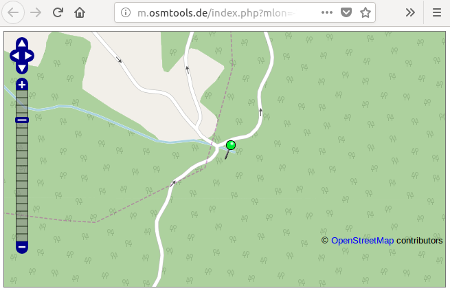

# A Brief Tour of MyPhotoShare v3.4...

Version 3.4 of MyPhotoShare brings new features usually not found in static photo galleries. We offer you a visual tour of some of them.

## A new look for each user

The gallery owner can define global options in the configuration file but each visitor can have a personal look. For instance, the owner will decide if he wants colored or grayed social icons and which social sites to display. But the visitor will be able to have squared thumbnails or rectangular ones, sort the thumbnails by date or by name, etc.

* User options are accessible from a drop down menu on the right top.

* User decided to have squared thumbnails. In that case, if OpenCV is installed on the server, it will be used to center faces in the thumbnails.

* User rather wants to have full thumbnails...

## Browse the media the way you want

MyPhotoShare allows you to browse the media by album, by date or by location if the photos are geotagged.

* MyPhotoShare extracts date information and other metadata from pictures' EXIF and sorts your photos by year, month and and day.

* If the photos have geotags, this metadata is used by MyPhotoShare and you can browse your media content by location, from country down to city or town. MyPhotoShare includes a database of 10000 location names from [GeoNames.org](https://www.geonames.org/) and you can even update this file to get localized names.

* A location icon appears over each media that have geotag metadata.

* Click on the location icon to see on a map where the photo was shot.

## Add metadata to your pictures

You don't have a GPS and your photos are not geotagged but you know where they were captured and you don't want to loose this information. Or you want to add memories to your photos. Even without having a database or a CMS, MyPhotoShare offers you powerful features that don't lock you to a technology. The gallery owner can add user defined metadata in an `album.ini` file and drop it in a photos directory.

* Edit your metadata in the `album.ini` file with a simple syntax. When you move an album, the metadata follows the media. You can even use the `make_album_ini.sh` script to create skeleton `album.ini` files from your existing albums.

* All metadata can be viewed in the metadata window.

## Find a needle in a haystack

We kept the best for the last. Where is this photo you took a few years ago, with your children playing on the beach? MyPhotoShare indexes all texts in album names, photo names and descriptive metadata that you put in `album.ini` files and uses them in the search menu.

* Search by keywords, by part or complete word, case sensitive or not. You can even refine your search results!

**These are only the tip of MyPhotoShare 3.4 features. Try and discover them by yourselves!**