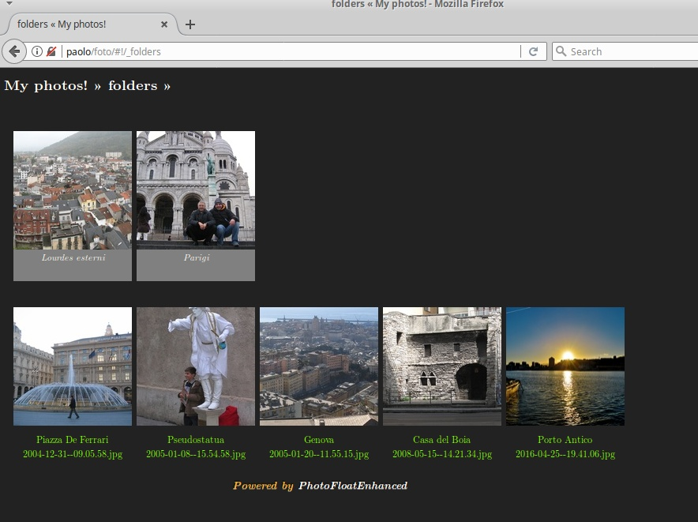
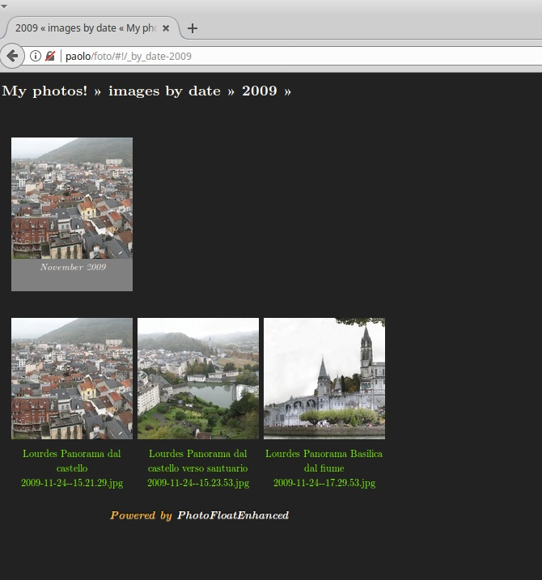

# A gallery of galleries

Before we can build a visual tour of MyPhotoShare advanced features, here are a few screen captures through versions...

## View it by yourself on the web

* [Assunta Palmaro](http://palmaro.qumran2.net/)

## Version 3.3

## Version 2.2

## Version 1

